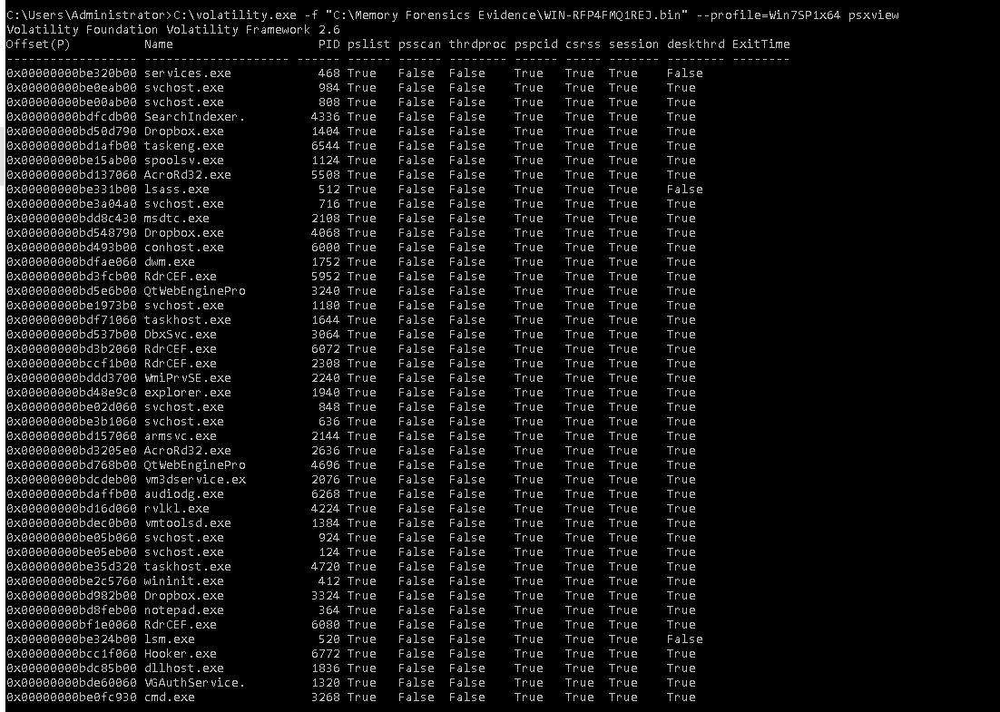

# Memory-forensics-volatility-analysis
Memory forensics and malware analysis using Volatility Framework for process, privilege, and network investigation.
# Memory Forensics & Malware Analysis using Volatility

## Objective

This project demonstrates practical memory forensics and malware investigation techniques using the Volatility Framework.

The analysis focused on identifying:
- hidden processes
- suspicious executables
- command and control (C2) communication
- privilege escalation indicators
- malicious memory artifacts

## Tools Used

- Volatility Framework
- Windows Memory Images
- Command Line Analysis
- Process and Network Enumeration

## Key Investigation Areas

### Process Analysis
Identified suspicious and hidden processes running in memory.

### Network Analysis
Investigated active and historical network connections for possible C2 communication.

### Malware Artifact Detection
Detected suspicious executables and extracted memory artifacts for analysis.

### Privilege Escalation Indicators
Reviewed process privileges and suspicious elevated permissions.

## Skills Demonstrated

- Digital Forensics
- Incident Response
- Threat Hunting
- Malware Investigation
- Memory Analysis
- Security Analysis

## Screenshots

### Hidden Process Detection

### Suspicious Executable Analysis

### Network Connection Investigation

